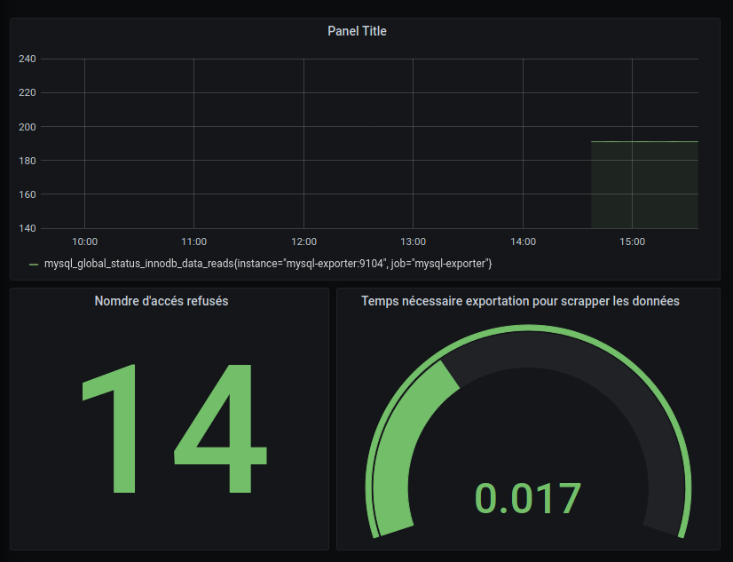
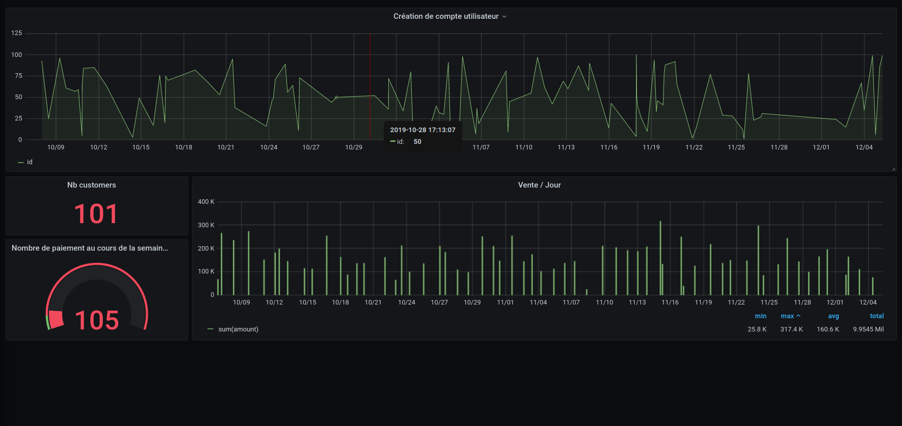

# TP9 - Grafana

## Réglages

- On reprend exactement le même docker-compose quand dans le TP8 mais on y ajoute l'image graphana. Les fichiers prometheus et mysql-exporter ne change pas.

- En suite, comme d'habitude : `docker-compose up -d`
- On peut donc se rendre à l'addresse `localhost:3000` puis ce connecter avec les identifiants admin/admin.
- On paramètre prometheus et mysql dans grafana en indicant leur adresse + port ainsi que le nom de la database pour mysql.

On peut maintenant commencer à se créer des dashboards.

## 1er dashboard

Ce dashboard est créé à partir de trois éléments :

- [metrics read](graph-screenshots/dashboard1_item1.png)
- [metrics error](graph-screenshots/dashboard1_item2.png)
- [metrics export](graph-screenshots/dashboard1_item3.png)

## 2ème dashboard

Ce dashboard est créé à partir de 4 éléments :

- [Nombre de compte utilisateur créés](graph-screenshots/dashboard2_item1.png)
- [Nombre de customers](graph-screenshots/dashboard2_item2.png)
- [Nombre de paiement la semaine passé](graph-screenshots/dashboard2_item3.png)
- [Nombre de vente par jour](graph-screenshots/dashboard2_item4.png)

